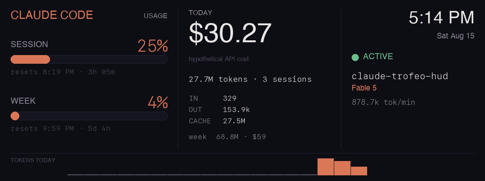

# claude-trofeo-hud

A desk HUD that shows live Claude usage on a Thermalright Trofeo Vision 6.86"
LCD (1280×480, USB-C, ~$38), driven from macOS. Inspired by the r/ClaudeAI
"$38 Claude LCD Table Display" post.



What it shows: Pro/Max session + weekly limit bars with reset countdowns
(from Anthropic's usage endpoint), today's tokens and hypothetical API cost
(via [ccusage](https://github.com/ryoppippi/ccusage)), the live session
(project, model, burn rate), a clock, and an hourly token sparkline.

## Requirements

- macOS, Python 3.12+, [uv](https://docs.astral.sh/uv/), Node (for `npx ccusage`)
- `brew install hidapi` (C library behind the `hidapi` Python package)
- Claude Code installed and logged in (the HUD reads its local logs and its
  OAuth token from the Keychain — read-only, and the only thing sent anywhere
  is the usage query to api.anthropic.com)

### A note on `ccusage`

Token and cost figures come from [ccusage](https://github.com/ryoppippi/ccusage),
third-party code that the daemon executes via `npx` every 60 seconds. It is
pinned to an exact version in `collectors/tokens.py`, so upgrading it is a
deliberate, reviewable change rather than something that happens on its own —
worth knowing, since the daemon runs with standing Keychain access. With a warm
npm cache the run needs no network, but resolving the package can reach the
registry when that cache goes stale.

## Setup

```bash
uv sync
uv run python -m claude_trofeo_hud preview   # render mock layout to out/preview.png
uv run python -m claude_trofeo_hud run       # live HUD on the LCD (Ctrl-C stops)
uv run python -m claude_trofeo_hud install-agent   # start at login via launchd
```

On the first `run`, macOS asks for Keychain access to "Claude Code-credentials"
— choose **Always Allow** so the daemon can run unattended.

`uninstall-agent` stops and removes the launchd agent. Config lives in
[config.toml](config.toml) (fps, JPEG quality, night dim/off hours). Logs go to
`~/Library/Logs/claude-trofeo-hud/`.

## How it drives the display

The panel is not a monitor — it's a USB HID device (VID:PID `0416:5302`) that
accepts JPEG frames over a reverse-engineered protocol. We use the device
classes from [thermalright-trcc-linux](https://github.com/Lexonight1/thermalright-trcc-linux)
with its `HidApiTransport` (IOHIDManager), bypassing its CLI — trcc's default
transport routes through libusb, which macOS blocks for HID devices. The
firmware blanks when idle, so the HUD streams continuously (default 2 fps).
See [PLANNING.md](PLANNING.md) for the full protocol notes.

## Troubleshooting

- **"Access denied (insufficient permissions)"** — something is opening the
  device via libusb instead of hidapi; make sure you're running our CLI, not
  `trcc` directly.
- **Panel shows boot logo / blanks** — no frames arriving; check
  `~/Library/Logs/claude-trofeo-hud/hud.log`. Unplug/replug is handled
  automatically with backoff.
- **Empty cost/tokens** — `npx ccusage` must work in a terminal first; the
  launchd agent bakes the node path into its plist at install time, so
  re-run `install-agent` after Node upgrades.
- **Limits stale** — Keychain access not granted, or you're logged out of
  Claude Code.
